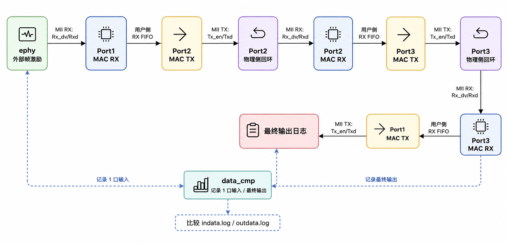

# 三端口 MAC 遍历回环验证工程

[GitHub 仓库](https://github.com/jerryhuang392diandi/jichengMAC-back) |
[Gitee 仓库](https://gitee.com/jerryhqx/jichengMAC-back) |
[更新记录](./CHANGELOG.md)

本仓库是集成电路课程 final project 的 ModelSim 仿真工程。工程基于老师给出的开源以太网 MAC 核和原始自回环仿真环境，将单端口回环验证扩展为三端口遍历回环验证。

本次改造的边界很明确：不修改 `new_mac/hdl/` 下 MAC 核 RTL，只在仿真层新增三端口连接、配置和验证逻辑。最终目标是证明一组以太网帧可以按 `Port1 -> Port2 -> Port3 -> Port1` 的路径完整走完，并且最终从 Port1 发出的数据与最初进入 Port1 的数据一致。

## 最近更新（2026-06-11）

- 将单个 `data_cmp` 扩展为 `MAC1`、`MAC2`、`MAC3` 三个独立监视器，可分别记录每个端口的物理侧输入和输出。
- 日志文件名增加 MAC 标识，每个 testcase 现在生成 6 份日志，便于逐跳定位数据错误。
- 修正 `data_cmp.v` 中 TX 信号的延迟采样时钟，由 `Rx_clk` 改为对应的 `Tx_clk`。
- 两个 testcase 在结束时依次等待并关闭三个监视器，避免日志未完整写入。
- 使用 ModelSim 10.4 重新完成 100M 和 1000M 仿真：每种模式 100 帧，编译与仿真均为 0 错误、0 警告，三个 MAC 的输入输出日志逐对一致。
- 增加最终课程报告 `集成电路导论大作业报告.pdf`，并整理本地文档与仿真产物的忽略规则。

## 验证拓扑

README 中使用的拓扑图已经放到仓库内，路径为 `./assets/topology.png`。不要再直接粘 CSDN 或网页外链图，否则在 GitHub/Gitee 上容易因为防盗链或图片权限失效而显示不出来。



数据流如下：

```text
ephy 外部帧激励
  -> Port1 MAC RX
  -> Port2 MAC TX
  -> Port2 物理侧回环
  -> Port2 MAC RX
  -> Port3 MAC TX
  -> Port3 物理侧回环
  -> Port3 MAC RX
  -> Port1 MAC TX
  -> data_cmp 记录最终输出
```

三个 `data_cmp` 实例分别监听 Port1、Port2、Port3 的物理侧输入和输出，生成：

```text
new_mac/sim/in_out/<testcase>_MAC1_indata.log
new_mac/sim/in_out/<testcase>_MAC1_outdata.log
new_mac/sim/in_out/<testcase>_MAC2_indata.log
new_mac/sim/in_out/<testcase>_MAC2_outdata.log
new_mac/sim/in_out/<testcase>_MAC3_indata.log
new_mac/sim/in_out/<testcase>_MAC3_outdata.log
```

逐对比较三个 MAC 的输入输出日志，可以同时确认最终结果和每一跳物理侧回环的数据一致性。

## MAC 核背景

课程文档里的 MAC 核来自 OpenCores Ethernet MAC IP。它位于以太网数据链路层，负责把用户侧帧数据转换成可以送到 PHY 的 MII/GMII 数据流，也负责把 PHY 收到的帧还原成用户侧 FIFO 数据。

该 MAC 核的主要功能包括：

- 发送时自动添加前导码和帧起始标志 SFD，前导码为 7 字节 `0x55`，SFD 为 `0xd5`。
- 对长度不足的帧进行填充，使以太网帧长度满足 64 字节最小帧长要求。
- 接收时可进行 CRC 校验。
- 支持 10M、100M、1000M 模式，课程实验主要使用 100M 和 1000M。
- 1000M 全双工模式下支持标准流控机制。
- 通过 MII/GMII 类接口与 PHY 侧连接，通过 FIFO 类接口与用户逻辑连接，通过 Host/Register 接口完成寄存器配置。

本工程把它当成一个可配置的 MAC 黑盒使用，重点验证多个 MAC 实例之间的连接、回环和数据一致性。

## 工程目录

```text
.
├── assets/
│   └── topology.png
├── new_mac/
│   ├── doc/
│   │   ├── 参考视频.mp4
│   │   ├── 实验MAC核.docx
│   │   ├── MAC核控制器及回环验证实验.pdf
│   │   └── Modelsim仿真与FPGA工具应用.pdf
│   ├── hdl/
│   │   ├── MAC_top.v
│   │   ├── MAC_rx.v / MAC_tx.v
│   │   ├── MAC_rx_ctrl.v / MAC_tx_Ctrl.v
│   │   ├── CRC_chk.v / CRC_gen.v
│   │   ├── reg_int.v / RMON.v / Phy_int.v
│   │   └── ...
│   ├── rtl.f
│   └── sim/
│       ├── bfm/
│       │   ├── altera_mf.v
│       │   ├── clockGenerator.v
│       │   ├── data_cmp.v
│       │   ├── ephy.v
│       │   └── host_sim.v
│       ├── filelist/
│       │   ├── hdl_filelist.v
│       │   ├── rtl.f
│       │   └── sim_filelist.v
│       ├── in_out/
│       │   ├── 0100000064_MAC[1-3]_[in|out]data.log
│       │   └── 0100000065_MAC[1-3]_[in|out]data.log
│       ├── run/
│       │   ├── modelsim.ini
│       │   ├── run.bat
│       │   ├── sim.do
│       │   ├── top_define.v
│       │   └── wave.do
│       ├── testbench/
│       │   └── testbench.v
│       └── testcase/
│           ├── 0100000064.v
│           └── 0100000065.v
├── .gitattributes
├── .gitignore
├── 集成电路导论大作业报告.pdf
├── LICENSE
└── README.md
```

其中：

- `new_mac/hdl/` 是 MAC 核 RTL，不是本次改造重点。
- `new_mac/sim/testbench/testbench.v` 是三端口连接和验证逻辑的核心文件。
- `new_mac/sim/bfm/ephy.v` 负责产生外部以太网帧激励。
- `new_mac/sim/bfm/host_sim.v` 负责模拟 CPU 写寄存器，配置 MAC 工作模式。
- `new_mac/sim/bfm/data_cmp.v` 是可参数化的数据监视器，负责分别记录三个 MAC 的输入输出日志。
- `new_mac/sim/run/sim.do` 是 ModelSim 编译、加载、运行脚本。

## 顶层引脚说明

`new_mac/hdl/MAC_top.v` 的端口可以按功能分成四组。课程文档里给了 MAC 核外围管脚图，下面结合源码整理成表格。

| 接口组 | 主要信号 | 方向 | 作用 |
| --- | --- | --- | --- |
| 系统时钟与复位 | `Reset`、`Clk_125M`、`Clk_user`、`Clk_reg`、`Speed[2:0]` | 输入/输出 | 提供复位、125 MHz 基准时钟、用户侧时钟、寄存器配置时钟，并输出当前速率 |
| 用户侧 RX FIFO | `ff_rx_rdy`、`ff_rx_data[31:0]`、`ff_rx_mod[1:0]`、`ff_rx_sop`、`ff_rx_eop`、`ff_rx_dsav`、`ff_rx_dval`、`rx_err[5:0]` | MAC 输出为主 | MAC 收到 PHY 侧帧后，将帧以 32 bit FIFO 格式交给用户逻辑 |
| 用户侧 TX FIFO | `ff_tx_data[31:0]`、`ff_tx_mod[1:0]`、`ff_tx_sop`、`ff_tx_eop`、`ff_tx_wren`、`ff_tx_err`、`tx_ff_uflow`、`ff_tx_rdy`、`ff_tx_septy` | MAC 输入为主 | 用户逻辑把待发送帧写入 MAC，MAC 再从 PHY 侧发出 |
| PHY/MII 侧 | `Rx_clk`、`Tx_clk`、`Rx_er`、`Rx_dv`、`Rxd[7:0]`、`Tx_er`、`Tx_en`、`Txd[7:0]`、`Crs`、`Col` | 双向 | 与 PHY 或仿真 PHY 模型连接，100M 时有效数据使用低 4 bit，1000M 时使用 8 bit |
| Host/Register | `CSB`、`WRB`、`CD_in[15:0]`、`CD_out[15:0]`、`CA[7:0]` | 双向 | CPU/Host 配置接口，用于设置速率、水线、CRC、地址过滤等寄存器 |

本工程的三端口遍历主要改的是用户侧 FIFO 和 PHY/MII 侧连接；Host/Register 接口则复制三套 `host_sim`，分别配置三个 MAC 实例。

## 仿真环境配置

课程文档使用 Windows + ModelSim 作为主要仿真环境，文档中以 `modelsim10.1b` 为例，并说明一般要求 ModelSim 10.0 以上版本。本工程脚本同样按 Windows 下 ModelSim/QuestaSim 使用方式组织。

推荐环境：

- Windows 10/11，或课程机房 Windows 环境。
- ModelSim 10.x / QuestaSim，命令行能调用 `vsim`、`vlog`、`vlib`、`vmap`。
- Git LFS，用于拉取 `new_mac/doc/参考视频.mp4`。

### 1. 克隆仓库

```bat
git clone https://github.com/jerryhuang392diandi/jichengMAC-back.git
cd jichengMAC-back
```

或者：

```bat
git clone https://gitee.com/jerryhqx/jichengMAC-back.git
cd jichengMAC-back
```

### 2. 拉取 Git LFS 文件

参考视频由 Git LFS 管理。只跑仿真时可以不拉视频；如果要看文档视频，执行：

```bat
git lfs install
git lfs pull
```

### 3. 配置 ModelSim 命令行

安装 ModelSim/QuestaSim 后，新开一个 `cmd` 或 PowerShell，检查：

```bat
vsim -version
```

如果能打印版本号，说明 `PATH` 已配置好。

如果提示找不到 `vsim`，需要把 ModelSim 的可执行文件目录加入系统 `PATH`。常见路径如下，实际以本机安装目录为准：

```text
C:\modeltech64_10.5\win64
C:\modeltech64_10.5\win32
C:\questasim64_10.7c\win64
```

也可以不改系统环境变量，直接使用完整路径运行：

```bat
"C:\modeltech64_10.5\win64\vsim.exe" -c -do "do sim.do; quit -f"
```

如果启动时报 license 错误，需要按学校机房、实验室服务器或合法授权方式配置 license，例如设置 `LM_LICENSE_FILE`。README 不记录破解流程，避免环境不可复现和授权风险。

### 4. 避免中文路径问题

ModelSim 对中文路径和空格路径兼容性不稳定。本工程当前上级目录可能包含中文，建议映射成英文盘符后再运行：

```bat
subst X: "D:\study\大三下\集成电路\final_project"
cd /d X:\new_mac\sim\run
```

用完后取消映射：

```bat
subst X: /d
```

## 仿真脚本配置

本工程脚本使用相对路径，因此必须从 `new_mac/sim/run` 目录启动：

```bat
cd new_mac\sim\run
```

`sim.do` 完成以下工作：

```tcl
vlib ./lib/
vlib ./lib/work
vmap work ./lib/work

vlog -f ../filelist/sim_filelist.v
vlog -f ../filelist/hdl_filelist.v -cover bcesxf

vsim -voptargs=+acc -coverage work.testbench
log -r /*
do ./wave.do
run -all
```

两个文件列表的分工如下：

| 文件 | 作用 |
| --- | --- |
| `new_mac/sim/filelist/sim_filelist.v` | 编译仿真模型、`top_define.v`、`testbench.v` |
| `new_mac/sim/filelist/hdl_filelist.v` | 编译 `new_mac/hdl/` 下 MAC 核 RTL |

如果以后增加新的仿真辅助文件，加入 `sim_filelist.v`；如果增加新的 RTL 文件，加入 `hdl_filelist.v`。不要把 testbench 和 RTL 混在一个列表里，出错时不方便定位。

## 运行方法

方式一，打开 ModelSim 图形界面：

```bat
cd new_mac\sim\run
run.bat
```

`run.bat` 实际执行的是：

```bat
vsim -do sim.do
```

脚本末尾会删除 `work/`、`transcript`、`vsim.wlf` 等临时文件。如果需要保留 `transcript`，可以临时注释掉 `run.bat` 末尾的清理命令。

方式二，纯命令行运行：

```bat
cd new_mac\sim\run
vsim -c -do "do sim.do; quit -f"
```

如果工程路径包含中文，建议先映射盘符：

```bat
subst X: "D:\study\大三下\集成电路\final_project"
cd /d X:\new_mac\sim\run
vsim -c -do "do sim.do; quit -f"
```

## 三端口连接讲解

核心连接在 `new_mac/sim/testbench/testbench.v`。

### 1. 实例化三个 MAC

testbench 里实例化了三套 `MAC_top`：

```verilog
MAC_top MAC_top_inst1(...);  // Port1
MAC_top MAC_top_inst2(...);  // Port2
MAC_top MAC_top_inst3(...);  // Port3
```

每个 MAC 都有独立的 Host 配置接口：

```verilog
host_sim U_host_sim (...);   // 配置 Port1
host_sim U_host_sim2(...);   // 配置 Port2
host_sim U_host_sim3(...);   // 配置 Port3
```

这样可以保证三个端口的速率寄存器、水线寄存器都被同步配置。

### 2. Port1 从 ephy 接收外部帧

`ephy` 是仿真 PHY 激励模型，负责产生外部输入帧。它连接到 Port1 的 MII RX 侧：

```verilog
ephy U_ephy_hm(
  .Rx_er(hm_Rx_er),
  .Rx_dv(hm_Rx_dv),
  .Rxd(hm_Rxd),
  .mode(mode)
);

MAC_top MAC_top_inst1(
  .Rx_er(hm_Rx_er),
  .Rx_dv(hm_Rx_dv),
  .Rxd(hm_Rxd),
  ...
);
```

因此，测试帧首先进入 Port1 MAC RX。

### 3. 用户侧 FIFO 串接成 `1 -> 2 -> 3 -> 1`

收到的帧不是直接送回本端口，而是通过用户侧 FIFO 信号送到下一个端口的 TX。

Port1 RX 接到 Port2 TX：

```verilog
MAC_top_inst2.ff_tx_data = ff_rx_data_mac;
MAC_top_inst2.ff_tx_mod  = ff_rx_mod_mac;
MAC_top_inst2.ff_tx_sop  = ff_rx_sop_mac;
MAC_top_inst2.ff_tx_eop  = ff_rx_eop_mac;
MAC_top_inst2.ff_tx_wren = ff_rx_dval_mac;
```

Port2 RX 接到 Port3 TX：

```verilog
MAC_top_inst3.ff_tx_data = ff_rx_data2;
MAC_top_inst3.ff_tx_mod  = ff_rx_mod2;
MAC_top_inst3.ff_tx_sop  = ff_rx_sop2;
MAC_top_inst3.ff_tx_eop  = ff_rx_eop2;
MAC_top_inst3.ff_tx_wren = ff_rx_dval2;
```

Port3 RX 接到 Port1 TX：

```verilog
MAC_top_inst1.ff_tx_data = ff_rx_data3;
MAC_top_inst1.ff_tx_mod  = ff_rx_mod3;
MAC_top_inst1.ff_tx_sop  = ff_rx_sop3;
MAC_top_inst1.ff_tx_eop  = ff_rx_eop3;
MAC_top_inst1.ff_tx_wren = ff_rx_dval3;
```

源码里这些连接是通过 `MAC_top` 例化端口完成的，不是用 `assign` 单独写出来的。对应关系可以在 `MAC_top_inst1`、`MAC_top_inst2`、`MAC_top_inst3` 的 `.ff_tx_*` 和 `.ff_rx_*` 端口处查看。

### 4. Port2 和 Port3 做物理侧回环

Port2、Port3 需要先从 TX 侧发出，再回到自己的 RX 侧，这样才能进入下一段用户侧转发。testbench 中用一段时序逻辑实现物理侧回环：

```verilog
always @(posedge Rx_clk or posedge reset)
begin
    if (reset) begin
        hm_Rx_er2 <= 1'b0;
        hm_Rx_dv2 <= 1'b0;
        hm_Rxd2   <= 8'h00;
        hm_Rx_er3 <= 1'b0;
        hm_Rx_dv3 <= 1'b0;
        hm_Rxd3   <= 8'h00;
    end else begin
        hm_Rx_er2 <= hm_Tx_er2;
        hm_Rx_dv2 <= hm_Tx_en2;
        hm_Rxd2   <= hm_Txd2;
        hm_Rx_er3 <= hm_Tx_er3;
        hm_Rx_dv3 <= hm_Tx_en3;
        hm_Rxd3   <= hm_Txd3;
    end
end
```

这段逻辑等价于：

```text
Port2 MII TX: Tx_en/Txd -> Port2 MII RX: Rx_dv/Rxd
Port3 MII TX: Tx_en/Txd -> Port3 MII RX: Rx_dv/Rxd
```

Port1 不做本地物理回环，因为 Port1 的 RX 是外部输入，Port1 的 TX 是最终输出。

### 5. ready 信号避免 FIFO 被写爆

`ff_rx_rdy` 表示下游是否能接收当前 MAC RX 输出。三端口串接后，ready 也要跟着下游 TX FIFO 状态走：

```verilog
assign p1_rx_rdy = rdy & p2_ff_tx_rdy;

MAC_top_inst1.ff_rx_rdy = p1_rx_rdy;
MAC_top_inst2.ff_rx_rdy = p3_ff_tx_rdy;
MAC_top_inst3.ff_rx_rdy = p1_ff_tx_rdy;
```

含义是：

- Port1 只有在全局 `rdy` 有效且 Port2 TX FIFO 准备好时，才把 RX 数据吐给用户侧。
- Port2 RX 受 Port3 TX FIFO ready 控制。
- Port3 RX 受 Port1 TX FIFO ready 控制。

## 寄存器和 testcase 配置

`testbench.v` 中的 `CHOOSE_MODE` 是每个 testcase 运行前的主要配置入口。

先配置三个 MAC 的 RX FIFO 水线：

```verilog
U_host_sim.CPU_wr(7'd22,16'd4);
U_host_sim.CPU_wr(7'd23,16'd2);
U_host_sim2.CPU_wr(7'd22,16'd4);
U_host_sim2.CPU_wr(7'd23,16'd2);
U_host_sim3.CPU_wr(7'd22,16'd4);
U_host_sim3.CPU_wr(7'd23,16'd2);
```

这里 22、23 号寄存器分别配置 `Rx_Hwmark = 4`、`Rx_Lwmark = 2`。这属于本次调试中额外做的稳定性处理：三端口路径比原始单端口自回环更长，1000M 下如果 RX FIFO 水线过大，链路末尾可能排空不及时。

再配置三个 MAC 的工作速率：

```verilog
if (mode == 0) begin
    U_host_sim.CPU_wr(7'd34,16'h2);
    U_host_sim2.CPU_wr(7'd34,16'h2);
    U_host_sim3.CPU_wr(7'd34,16'h2);
end else begin
    U_host_sim.CPU_wr(7'd34,16'h4);
    U_host_sim2.CPU_wr(7'd34,16'h4);
    U_host_sim3.CPU_wr(7'd34,16'h4);
end
```

34 号寄存器是速率配置：

| `mode` | 寄存器值 | 测试速率 |
| --- | --- | --- |
| `1'b0` | `16'h2` | 100M |
| `1'b1` | `16'h4` | 1000M |

当前有两个 testcase：

| 用例 | 文件 | 速率 | 激励 |
| --- | --- | --- | --- |
| `0100000064` | `new_mac/sim/testcase/0100000064.v` | 100M | 100 帧随机长度以太网帧 |
| `0100000065` | `new_mac/sim/testcase/0100000065.v` | 1000M | 100 帧随机长度以太网帧 |

testcase 基本结构如下：

```verilog
testcase_name = "0100000064";
mode = 1'b0;
U_clockGenerator.RESET;
CHOOSE_MODE;

repeat(100) begin
   len = 64 + {$random}%(1518 - 64);
   U_ephy_hm.send_frame_100M(len, i);
   i = i + 1;
end

U_data_cmp.OVER;
```

1000M 用例调用的是 `send_frame_1000M`，并在结束前额外等待一段时间，保证尾部数据走完整个三端口路径。

## 额外完成的工作

除了把原始自回环改成三端口遍历回环，本工程还做了这些补充工作：

- 增加三套 `MAC_top` 实例和三套 `host_sim` 配置接口，使三个端口都能独立初始化。
- 将用户侧 FIFO 连接改成 `Port1 RX -> Port2 TX -> Port2 RX -> Port3 TX -> Port3 RX -> Port1 TX`。
- 为 Port2、Port3 增加物理侧回环逻辑，模拟帧从本端口 TX 回到本端口 RX。
- 在 `testbench.v` 中增加端口收发计数和 TX FIFO 下溢计数，仿真结束打印 `PORT_COUNTS` 和 `USER_COUNTS`。
- 将 `data_cmp.v` 参数化为 `MAC1`、`MAC2`、`MAC3` 三个监视器，并修正 TX 信号使用 `Tx_clk` 采样。
- 修改 `data_cmp.v` 的 `OVER` 任务，在关闭日志前等待输出帧数追上输入帧数；两个 testcase 会依次结束三个监视器，避免最后几帧被提前截断。
- 调低三个 MAC 的 RX FIFO 水线，提升 1000M 遍历回环仿真的稳定性。
- 新增 100M、1000M 两组随机长度帧测试，并保留输入/输出日志。
- 将 README 拓扑图整理为仓库内相对路径 `./assets/topology.png`，避免外链图片丢失。
- 补充最终课程报告，并忽略本地发布稿、个人导出报告和 ModelSim 运行产物。

## 查看验证结果

仿真结束后重点看：

```text
new_mac/sim/run/transcript
new_mac/sim/in_out/0100000064_MAC1_indata.log
new_mac/sim/in_out/0100000064_MAC1_outdata.log
new_mac/sim/in_out/0100000064_MAC2_indata.log
new_mac/sim/in_out/0100000064_MAC2_outdata.log
new_mac/sim/in_out/0100000064_MAC3_indata.log
new_mac/sim/in_out/0100000064_MAC3_outdata.log
new_mac/sim/in_out/0100000065_MAC1_indata.log
new_mac/sim/in_out/0100000065_MAC1_outdata.log
new_mac/sim/in_out/0100000065_MAC2_indata.log
new_mac/sim/in_out/0100000065_MAC2_outdata.log
new_mac/sim/in_out/0100000065_MAC3_indata.log
new_mac/sim/in_out/0100000065_MAC3_outdata.log
```

在 `transcript` 中搜索：

```text
Errors:
Warnings:
PORT_COUNTS
USER_COUNTS
```

当前工程已得到的计数结果为：

```text
PORT_COUNTS 0100000064 p1_tx=100 p2_tx=100 p2_rx=100 p3_tx=100 p3_rx=100
USER_COUNTS 0100000064 p1_rx=100 p2_rx=100 p3_rx=100 uflow=0/0/0

PORT_COUNTS 0100000065 p1_tx=100 p2_tx=100 p2_rx=100 p3_tx=100 p3_rx=100
USER_COUNTS 0100000065 p1_rx=100 p2_rx=100 p3_rx=100 uflow=0/0/0
```

2026-06-11 使用 ModelSim 10.4 重新验证，仿真编译与运行均为 `Errors: 0, Warnings: 0`。每个监视器记录 100 帧，三个 MAC 的输入输出 SHA256 逐对一致：

| 用例 | 监视器 | 输入/输出 SHA256 | 结果 |
| --- | --- | --- | --- |
| `0100000064`（100M） | `MAC1` / `MAC2` / `MAC3` | `EF14C2622EB01BB12C0052A3AD639463646885C4280AB5F53F50BB5754ABAD96` | 三组均一致 |
| `0100000065`（1000M） | `MAC1` / `MAC2` / `MAC3` | `D6D5EAB247D20A5EA90CC1B88078CB8F091B623317C230CD212AD2FFA7965CEB` | 三组均一致 |

在 PowerShell 中可以这样复查：

```powershell
Get-FileHash ..\in_out\0100000064_MAC*_*.log -Algorithm SHA256
Get-FileHash ..\in_out\0100000065_MAC*_*.log -Algorithm SHA256
```

在 `cmd` 中也可以用 Windows 自带 `fc`：

```bat
fc ..\in_out\0100000064_MAC1_indata.log ..\in_out\0100000064_MAC1_outdata.log
fc ..\in_out\0100000064_MAC2_indata.log ..\in_out\0100000064_MAC2_outdata.log
fc ..\in_out\0100000064_MAC3_indata.log ..\in_out\0100000064_MAC3_outdata.log
```

注意 PowerShell 里的 `fc` 是 `Format-Custom` 别名，不是文件比较命令；如果在 PowerShell 中想用 Windows 的 `fc`，需要写成 `cmd /c fc ...`。

## 常见问题

### GitHub 或 Gitee 上图片不显示

检查 README 是否使用了本地相对路径：

```markdown

```

不要直接使用 CSDN 图片链接或复制浏览器缓存里的图片地址。图片文件必须真实存在于仓库中，并随代码一起提交。

### `vsim` 找不到

说明 ModelSim/QuestaSim 没有加入 `PATH`。把安装目录下的 `win64` 或 `win32` 目录加入系统环境变量，或者在命令里使用 `vsim.exe` 的完整路径。

### 中文路径导致脚本打不开

优先把工程放到纯英文路径，或者用 `subst` 映射盘符：

```bat
subst X: "D:\study\大三下\集成电路\final_project"
cd /d X:\new_mac\sim\run
```

### 运行后出现 `work/`、`lib/`、`vsim.wlf`

这些都是 ModelSim 运行产物。`run.bat` 会清理其中一部分，`.gitignore` 也会忽略常见临时文件。

### 参考视频没有拉下来

执行：

```bat
git lfs install
git lfs pull
```

只做 Verilog 仿真时，不拉取视频不影响编译和运行。

## 结论

本工程完成了三端口 MAC 遍历回环验证。100M 和 1000M 两种模式下，100 帧随机长度以太网帧均能按 `Port1 -> Port2 -> Port3 -> Port1` 传递，三个 MAC 监视器的输入输出日志逐对一致，中间端口收发计数一致，三个端口 TX FIFO 下溢计数均为 0。
